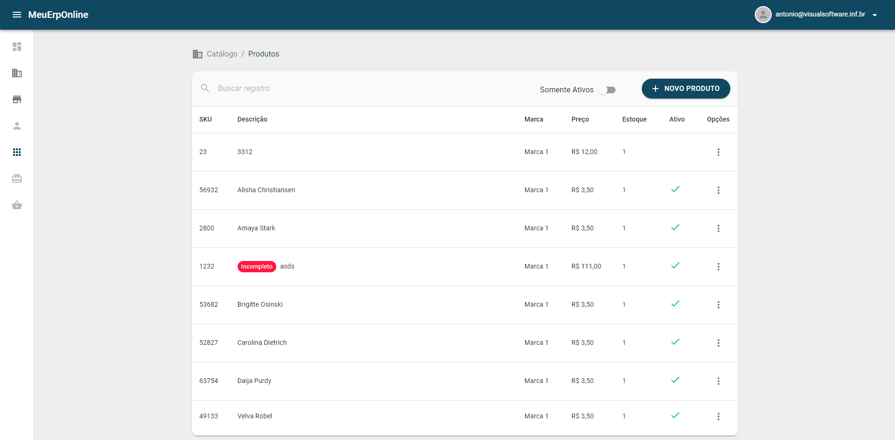

# Quer trabalhar em nosso time de frontend?

Esse é o nosso desafio para você! O objetivo é avaliar o seu conhecimento e habilidades nos seguintes quesitos:

Não esperamos que você conclua 100% o desafio e utilize todos os conceitos citados.

Observaremos boas práticas de desenvolvimento, legibilidade, design de código, design patterns e todo workflow da aplicação. Crie, commite e organize o projeto livremente mas lembre-se "grandes poderes trazem grandes responsabilidades"

## Sobre a SPA:

Crie um projeto e reproduza a tela acima, prestando atenção aos detalhes de estilização (colors, margins, paddings) e nas funcionalidades sugeridas (pesquisas, filtros, menu e outros easter eggs).

A forma de componentização é livre e você pode priorizar partes que demonstrem melhor seu conhecimento em front-end. Testes automatizados, documentação do projeto e componentes são diferenciais.

Documente tudo que julgar necessário, inclusive as motivações de diferentes bibliotecas e Frameworks utilizadas.

##### Utilize nossa API de produtos: 
```GET: https://devmeuerponline.azurewebsites.net/api/produtos```, para este endpoint é possível a utilização dos seguintes parametros: pagina (number), tamanhoPagina (number),frase (string), iremos avaliar a sua criativade na implantação de métodos de exibição dos resultados ex.: infiniteScroll, paginação.


## O que desejamos de você:
* Utilize React;
* Resolva problemas com funções do próprio ECMAScript 6.
* O layout deve ser responsivo (pelo menos dois breakpoints);

## O que vamos avaliar
* Boas práticas;
* Estilização;
* Javascript;
* Web Standards;
* Semântica
* Performance
* Organização
* Fluxo de trabalho utilizando Git (GitFlow);

## Prazo
Não existe prazo definido para entrega, mas gostariamos que anotasse uma planilha que pode ser anexada ao teste os horários trabalhados ex.: | 21/01 | 19:00 | 21:00 | onde 21/01 é o dia, 19:00 o horário que começou e 21:00 o horário que parou naquele dia.

## A apresentação do desafio
* Crie um repositório para o projeto em sua conta pessoal no GitHub;
* Crie um README.md com as instruções para a execução do projeto;